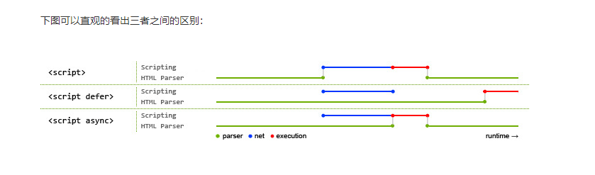

# FAQ?

## 怎么让页面上的某块区域全屏展示？

可以通过 HTML5 提供的 全屏 API，将该区域元素通过 requestFullscreen() 方法切换到全屏模式。

## 怎么在页面上获取用户的定位信息？

要在网页上获取用户的地理位置信息，可以使用 HTML5 提供的 Geolocation API，或者使用百度地图、高德地图等 SDK 进行获取。

## html 文档中常见的 &nbsp; 是什么，有什么作用？

- 需要保持单词或短语不被拆开时（如人名、数字单位等）。
- 用于精确控制空格数量。
- 实现特定的排版或对齐需求。

## canvas 与 svg 在可视化领域优劣如何

选择 `<canvas>` 还是 `<svg>` 取决于具体的需求和应用场景。如果你需要高性能、动态更新的图形绘制，`<canvas>` 是更好的选择。而如果你需要可维护的矢量图形、灵活的样式和交互，`<svg>` 是更合适的选择。在实际应用中，也可以根据需要将两者结合使用，以发挥各自的优势。

## html 中前缀为 data- 开头的元素属性是什么？

`data-` 属性提供了一种简洁的方法来将自定义数据存储在 HTML 元素中，这些数据可通过 JavaScript 进行访问和操作，而不会影响页面的标准表现。它们是现代 Web 开发中用于处理元素相关数据的有用工具。

## link 标签有哪些属性，分别有什么作用？

- href：指定资源 URL。
- rel：定义文档与资源的关系。
- type：指定资源 MIME 类型（主要用于样式表）。
- media：定义样式表的媒体条件。
- sizes：定义图标的尺寸。
- as：指定预加载资源的类型。
- crossorigin：设置跨域请求处理方式。

## link 标签的 rel 属性中，preload 和 prefetch 这两个值的作用是什么？

- preload：优先加载当前页面需要的关键资源，以提升页面加载速度。
- prefetch：预取未来可能需要的资源，以提高未来导航的速度。

## HTML 部分标签中的 crossorigin 属性，作用是什么？

- crossorigin="anonymous"：请求不包含凭证，适用于公开资源。
- crossorigin="use-credentials"：请求包含凭证，适用于需要用户认证的资源。

## SSG 的理解

SSG（Static Site Generation，静态网站生成）是指在构建时预先生成静态页面，并将这些页面部署到 CDN 或者其他存储服务中，以提升 Web 应用的性能和用户体验。

具体来说，SSG 的实现方式通常包括以下几个步骤：

1. 在开发阶段，使用模板引擎等技术创建静态页面模板；
2. 将需要展示的数据从后台 API 中获取或者通过其他渠道获取，并将其填充到静态页面模板中，生成完整的 HTML 页面；
3. 使用构建工具（例如 Gatsby、Next.js 等）对静态页面进行构建，生成静态 HTML、CSS 和 JavaScript 文件；
4. 部署生成好的静态文件到服务器或者 CDN 上，以供用户访问。

相比于传统的动态网页，SSG 具有如下优势：

1. 加载速度快：由于不需要每次请求都动态地渲染页面，SSG 可以减少页面加载时间，从而提高用户体验和搜索引擎排名；
2. 安全性高：由于没有后台代码和数据库，SSG 不容易受到 SQL 注入等攻击；
3. 成本低：由于不需要动态服务器等设备，SSG 可以降低网站的运维成本和服务器负担。

需要注意的是，SSG 不适用于频繁更新的内容和动态交互等场景，但对于内容较为稳定和更新较少的网站则是一个性能优化的好选择。

## Dom 树的理解

- **DOM 树** 是文档的结构化表示，包含了文档的所有元素、属性和文本节点。
- **操作 DOM** 是通过 JavaScript 对页面内容进行动态修改和控制的基础。
- **了解 DOM 树** 的结构和操作可以帮助开发者更有效地处理网页的动态内容和交互。

## Node 和 Element 是什么关系？

Node与Element的关系，从继承方面思考可能清晰很多。

Element 继承于 Node，具有Node的方法，同时又拓展了很多自己的特有方法。

在Element的一些方法里，是明确区分了Node和Element的。比如说：childNodes与 children, parentNode与parentElement等方法。

Node的一些方法，返回值为Node，比如说文本节点，注释节点之类的，而Element的一些方法，返回值则一定是Element。

区分清楚这点了，也能避免很多低级问题。

简单的说就是Node是一个基类，DOM中的`Element`，`Text和Comment`都继承于它。换句话说，`Element`，`Text`和`Comment`是三种特殊的Node，它们分别叫做`ELEMENT_NODE`,`TEXT_NODE`和`COMMENT_NODE`。

所以我们平时使用的 html上的元素，即`Element`，是类型为`ELEMENT_NODE`的`Node`。

## 前端跨页面通信，你知道哪些方法？

前端跨页面通信的方法主要包括：

1. **Web 存储 API**：使用 `LocalStorage` 或 `SessionStorage` 存储数据，在不同页面之间共享。
2. **Cookies**：通过设置和读取 Cookie 值在同一域名下的不同页面间传递信息。
3. **PostMessage**：允许在不同的窗口之间发送和接收消息，通过 `origin` 限制接收范围。
4. **Broadcast Channel**：创建频道实现类似发布-订阅模式的通信，适合标签页和 iframe 之间。
5. **SharedWorker**：共享的 Web Worker，允许不同页面通过 `postMessage` 进行双向通信。
6. **IndexedDB**：浏览器提供的客户端数据库，允许在不同页面间存储和共享数据。
7. **WebSockets**：全双工通信通道，适合实时通信，客户端和服务器间实时数据传输。

## 简单描述从输入网址到页面显示的过程

当输入URL到页面加载完成，发生了以下几个关键过程：

1. **DNS解析**：浏览器将URL解析为对应的IP地址。这个过程涉及多级DNS服务器，从本地缓存开始，如果没有找到，则递归查询根域名服务器、顶级域名服务器，直到找到目标服务器的IP地址。
2. **TCP连接**：浏览器通过三次握手与服务器建立TCP连接。一旦连接建立，浏览器可以发送HTTP请求。
3. **HTTP请求**：浏览器构建HTTP请求报文，通过TCP连接发送到服务器。请求报文包含请求行、请求头和请求正文。
4. **服务器处理请求**：服务器接收HTTP请求，解析请求内容，执行相应的处理（如数据库查询、文件读取等），并构建HTTP响应报文。
5. **HTTP响应**：服务器将响应报文通过TCP连接发送回浏览器。响应报文包含状态码、响应头和响应正文。
6. **浏览器解析渲染**：浏览器接收到HTTP响应后，解析HTML文档构建DOM树，解析CSS构建CSSOM树，合并两者形成渲染树，然后开始渲染页面。
7. **连接结束**：当浏览器完成页面渲染或收到服务器关闭连接的信号时，浏览器会发送TCP连接关闭的信号，服务器收到后，双方断开连接。

## 简述 html 页面渲染过程

1. **解析 HTML** -> 构建 DOM 树。
2. **解析 CSS** -> 构建 CSSOM 树。
3. **合并 DOM 和 CSSOM** -> 构建渲染树。
4. **计算布局** -> 生成布局信息。
5. **绘制页面** -> 将内容绘制到屏幕。
6. **合成和显示** -> 合成图层并显示页面。
7. **JavaScript 执行** -> 执行脚本可能导致重绘或回流。

## HTML5 有哪些新特性？

- 新增语义化标签：nav、header、footer、aside、section、article
- 音频、视频标签：audio、video
- 数据存储：localStorage、sessionStorage
- canvas（画布）、Geolocation（地理定位）、websocket（通信协议）
- input标签新增属性：placeholder、autocomplete、autofocus、required
- history API
  - go、forward、back、pushstate

## `<!DOCTYPE html>` 标签有什么用？

`<!DOCTYPE html>` 是 HTML5 文档的标准声明，用于告知浏览器当前页面遵循 HTML5 标准。它帮助浏览器以标准模式渲染网页，确保一致的用户体验和网页表现。

## iframe是什么？有哪些优缺点？

`<iframe>` 标签提供了一种便捷的方法来嵌入外部内容和实现特定的布局，但它也带来了一些性能、安全性、SEO 和用户体验方面的挑战。合理使用 `<iframe>` 并考虑其优缺点可以帮助开发人员在实现页面功能和保持页面性能之间找到平衡。

## canvas在标签上设置宽高，与在style中设置宽高有什么区别？

canvas标签的width和height是画布实际宽度和高度，绘制的图形都是在这个上面。

而style的width和height是canvas在浏览器中被渲染的高度和宽度。

如果canvas的width和height没指定或值不正确，就被设置成默认值。

## 如何禁用a标签跳转页面或定位链接?

当页面中a标签不需要任何跳转时，从原理上来讲，可分如下两种方法：

- 标签属性href，使其指向空或不返回任何内容。如：

```
<a href="javascript:void(0);" >点此无反应javascript:void(0)</a>

<a href="javascript:;" >点此无反应javascript:</a>
```

- 从标签事件入手，阻止其默认行为。如：

html方法：

```
<a href="" onclick="return false;">return false;</a>
<a href="#" onclick="return false;">return false;</a>
```

或者在js文件中阻止默认点击事件：

```
Event.preventDefault()
```

还可以在css文件中处理点击，不响应任何鼠标事件：

```
pointer-events: none;
```

## 常用的 meta 元素有哪些？

- **字符集**：`<meta charset="UTF-8">`
- **描述**：`<meta name="description" content="...">`
- **关键词**：`<meta name="keywords" content="...">`
- **作者**：`<meta name="author" content="...">`
- **视口**：`<meta name="viewport" content="...">`
- **刷新和重定向**：`<meta http-equiv="refresh" content="...">`
- **网页权限设置**：`<meta name="robots" content="...">`
- **兼容性**：`<meta http-equiv="X-UA-Compatible" content="IE=edge">`
- **Open Graph** 和 **Twitter Card** 元素用于社交媒体优化：`<meta property="og:image" content="...">`、`<meta name="twitter:card" content="summary_large_image">`

## JSONP 的缺点

JSONP（JSON with Padding）是一种利用 `<script>` 标签没有同源限制的特性来实现跨域数据请求的技术，但它存在不少缺点和局限：

1. **仅支持 GET 请求**：JSONP 通过动态插入 `<script>` 标签发起请求，本质上只能发送 GET 请求，无法支持 POST、PUT、DELETE 等 HTTP 方法，也无法通过请求体传递参数。

2. **安全性较差**：JSONP 实际上是让远端服务器返回一段 JavaScript 代码并在本地执行。如果远端服务器被劫持或返回恶意代码，就会直接在当前页面上下文中执行，导致 XSS 攻击。因此不能信任不受控的 JSONP 服务端。

3. **没有明确的错误处理机制**：`<script>` 标签加载失败时不会触发常规的 HTTP 错误回调，难以捕获 404、500 等状态码。只能通过 `onerror` 事件得知脚本加载失败，但拿不到具体错误信息，调试困难。

4. **服务端必须配合**：JSONP 要求服务端把数据包裹在一个函数调用中返回（即 `callback({...})`），如果服务端不支持这种格式就无法使用。

5. **无法使用 HTTP Header**：无法自定义请求头，不能携带 Cookie/Authorization 等鉴权信息，难以做身份验证。

6. **回调管理麻烦**：通常需要为每次请求生成一个全局回调函数，并在完成后清理，否则会造成全局变量污染或内存泄漏。

7. **已不推荐使用**：现代浏览器普遍支持 CORS，JSONP 已经基本被 CORS 取代，只有在不能修改服务端 CORS 配置且必须兼容老浏览器的场景下才会考虑使用。

由于上述缺点，JSONP 现在已基本被 CORS 和 `postMessage` 等更安全的方案取代。

## 如何实现跨域

跨域（Cross-Origin）是指浏览器执行脚本时，访问非同源（协议、域名、端口任一不同）的资源时受到同源策略限制。常见的跨域解决方案有以下几种：

**1. CORS（推荐）**

服务端在响应头中设置 `Access-Control-Allow-Origin` 等字段，浏览器就会放行跨域请求。CORS 分为简单请求和预检请求（OPTIONS）两种情况。前端代码不需要额外改造，是现代最常用的方案。

```
Access-Control-Allow-Origin: *
Access-Control-Allow-Methods: GET, POST, PUT, DELETE
Access-Control-Allow-Headers: Content-Type, Authorization
Access-Control-Allow-Credentials: true
```

**2. JSONP**

利用 `<script>` 标签没有同源限制的特性，通过动态创建 `<script>`，把回调函数名作为参数传给服务端，服务端返回一段调用该回调的 JS 代码。**只支持 GET 请求**，安全性较差，已基本被 CORS 取代。具体缺点详见 *JSONP 的缺点*。

**3. 代理服务器**

由于同源策略是浏览器的限制，服务器之间不存在跨域问题，可以通过 Nginx、Node 等代理服务器把请求转发到目标接口，对外暴露同源接口。

```nginx
server {
  location /api {
    proxy_pass http://target.com;
  }
}
```

**4. postMessage**

用于跨窗口（`window.open`、`iframe`）之间的通信，可以安全地实现跨域数据传递。

```js
// 发送
otherWindow.postMessage(data, targetOrigin)
// 接收
window.addEventListener('message', e => {
  if (e.origin !== 'https://target.com') return
  console.log(e.data)
})
```

**5. WebSocket**

WebSocket 协议本身不受同源策略限制，可以在客户端和服务器之间建立全双工通信。

**6. document.domain**

仅在主域相同、子域不同的场景下，通过设置相同的 `document.domain` 让父子页面互相访问。现代浏览器已逐渐废弃该特性。

**7. hash / fragment + iframe**

通过修改 URL 的 hash，并监听 `hashchange` 来传递数据，适合父子 iframe 间的简单通信。

**8. window.name**

`window.name` 在页面跳转后仍然保留，配合 iframe 可以实现跨域数据传递，现已基本不用。

**9. 跨子域 Cookie**

把 cookie 写到父域 `.example.com`，让子域之间共享身份信息。

实际项目中，CORS（接口跨域）+ Nginx 代理（部署跨域）是最常见的组合，JSONP 仅在兼容老浏览器或第三方接口受限时才考虑。

## dom 是什么，你的理解？

DOM（Document Object Model，文档对象模型）是 HTML/XML 文档在浏览器中的对象化表示，它把文档抽象为一棵由节点组成的树形结构，使得脚本（通常是 JavaScript）能够以编程方式访问、修改文档的内容、结构和样式。

**1. DOM 是数据结构**

浏览器解析 HTML 时，会根据标签嵌套关系构建出一棵 DOM 树，根节点是 `document`，每个标签、属性、文本都是树上的一个 Node。例如：

```html
<div id="app"><span>hello</span></div>
```

会被解析为：`document → html → body → div#app → span → "hello"`。

**2. DOM 是 API**

DOM 不仅指数据结构，也指 W3C 定义的一套操作文档的标准 API，包括：

- 节点查询：`getElementById`、`querySelector`、`querySelectorAll`
- 节点操作：`createElement`、`appendChild`、`removeChild`、`replaceChild`
- 属性操作：`getAttribute`、`setAttribute`、`dataset`
- 样式操作：`element.style`、`getComputedStyle`
- 事件：`addEventListener`、`removeEventListener`

**3. DOM 是语言无关的规范**

DOM 是 W3C 的规范，与 JS 没有强绑定，任何语言（如 Python、Java 的 SAX/DOM 解析器）都可以实现这套规范。在浏览器里，DOM 对象是由 C++ 实现的宿主对象，JS 只是持有其引用。

**4. 操作 DOM 的成本**

由于 DOM 节点是 C++ 对象，且每次修改都可能引起 reflow/repaint，DOM 操作是前端性能瓶颈之一。常见的优化手段包括：批量修改、DocumentFragment、虚拟 DOM（React/Vue）、防抖节流、把重排的动画交给 transform 等。

**5. 常见的 DOM 相关概念**

- 节点类型：`ELEMENT_NODE(1)`、`TEXT_NODE(3)`、`COMMENT_NODE(8)`、`DOCUMENT_NODE(9)` 等。
- Node 与 Element：Element 是 Node 的一种，详见 *Node 和 Element 是什么关系？*。

总结：DOM 是文档在内存中的结构化表示 + 一套操作文档的 API，是 JS 与页面交互的桥梁。

## 关于 dom 的 api 有什么

DOM API 涵盖范围较广，按照功能可以分为以下几类：

**1. 节点查询**

- `document.getElementById(id)`
- `document.getElementsByTagName(tag)`
- `document.getElementsByClassName(cls)`
- `document.querySelector(selector)` / `querySelectorAll(selector)`
- `document.getElementsByName(name)`
- `element.closest(selector)`：从当前元素开始向上查找匹配的最近祖先
- `element.matches(selector)`：判断元素是否匹配选择器

**2. 节点遍历**

- `node.childNodes` / `node.firstChild` / `node.lastChild` / `node.nextSibling` / `node.previousSibling`
- `element.children` / `element.firstElementChild` / `element.lastElementChild` / `element.nextElementSibling` / `element.previousElementSibling`

**3. 节点创建与增删改**

- `document.createElement(tag)`
- `document.createTextNode(text)`
- `document.createDocumentFragment()`
- `document.createComment(text)`
- `parent.appendChild(node)`
- `parent.insertBefore(node, ref)`
- `parent.removeChild(node)`
- `parent.replaceChild(newNode, oldNode)`
- `element.cloneNode(deep)`：深浅克隆
- `element.remove()`

**4. 属性与数据**

- `element.getAttribute(name)` / `setAttribute(name, value)` / `removeAttribute(name)` / `hasAttribute(name)`
- `element.id` / `element.className` / `element.classList`（`add` / `remove` / `toggle` / `contains`）
- `element.dataset`：读取 `data-*` 属性
- `element.innerHTML` / `outerHTML` / `textContent` / `innerText`

**5. 样式与尺寸**

- `element.style` / `getComputedStyle(el)`
- `element.className` / `classList`
- `element.getBoundingClientRect()`：返回 `width` / `height` / `top` / `left` / `right` / `bottom` / `x` / `y`
- `element.clientWidth` / `clientHeight` / `clientLeft` / `clientTop`
- `element.offsetWidth` / `offsetHeight` / `offsetLeft` / `offsetTop` / `offsetParent`
- `element.scrollWidth` / `scrollHeight` / `scrollLeft` / `scrollTop`

**6. 事件**

- `target.addEventListener(type, fn, useCapture)` / `removeEventListener`
- `target.dispatchEvent(event)`
- `new Event(type)` / `new CustomEvent(type, { detail })`
- 事件对象：`event.target` / `currentTarget` / `stopPropagation` / `preventDefault` / `stopImmediatePropagation`

**7. 文档与视图**

- `document.documentElement` / `document.body` / `document.head`
- `document.title` / `document.URL` / `document.domain` / `document.referrer`
- `document.cookie`
- `document.readyState` / `DOMContentLoaded` 事件
- `window.scrollTo(x, y)` / `scrollBy` / `scrollIntoView`

**8. 历史 API（History）**

- `history.back()` / `forward()` / `go(n)`
- `history.pushState(state, title, url)` / `replaceState(state, title, url)`
- `popstate` 事件

**9. 存储 API**

- `localStorage` / `sessionStorage`：`setItem` / `getItem` / `removeItem` / `clear`
- `IndexedDB`

**10. MutationObserver**

用于监听 DOM 变化：

```js
const ob = new MutationObserver(muts => { /* ... */ })
ob.observe(node, { childList: true, subtree: true, attributes: true })
ob.disconnect()
```

熟练掌握上述 API，是高效操作 DOM 与定位问题的基础。

## 节点类型 nodeType - 返回值

DOM 中每个 Node 都有一个 `nodeType` 属性，用来标识节点类型，返回值为整数。常见的 nodeType 取值如下：

| 常量 | 值 | 说明 |
| --- | --- | --- |
| `ELEMENT_NODE` | 1 | 元素节点，如 `<div>`、`<p>` |
| `ATTRIBUTE_NODE` | 2 | 属性节点（已废弃，不再出现在 DOM 树中） |
| `TEXT_NODE` | 3 | 文本节点，元素或属性中的文本 |
| `CDATA_SECTION_NODE` | 4 | CDATA 节点（XML 中使用） |
| `PROCESSING_INSTRUCTION_NODE` | 7 | 处理指令（XML 中使用） |
| `COMMENT_NODE` | 8 | 注释节点 `<!-- ... -->` |
| `DOCUMENT_NODE` | 9 | 整个文档，即 `document` |
| `DOCUMENT_TYPE_NODE` | 10 | 文档类型声明 `<!DOCTYPE html>` |
| `DOCUMENT_FRAGMENT_NODE` | 11 | `DocumentFragment`，文档片段 |
| `NOTATION_NODE` | 12 | DTD 中的 NOTATION（已废弃） |

**使用示例**

```js
document.nodeType === Node.DOCUMENT_NODE      // true (9)
document.body.nodeType === Node.ELEMENT_NODE // true (1)
document.body.firstChild.nodeType === 3       // 文本节点为 3
```

**面试常见点**

- 通过 `el.nodeType === 1` 判断一个节点是否为元素节点，比 `instanceof Element` 更稳妥。
- `nodeType === 3` 用于过滤文本节点。
- 属性节点（2）在现代 DOM 中已经不作为 DOM 树中的节点存在，而是通过 `getAttribute` / `setAttribute` 来操作。
- 旧版本 IE 中，`Node.ELEMENT_NODE` 这类常量不存在，需要手写 `=== 1`。

## 如何对项目中的图片进行优化？

1. 图片压缩：使用适当的图像压缩算法来减小图像文件的大小。可以使用图像编辑工具，如 Adobe Photoshop、GIMP 或在线压缩工具来压缩图片。压缩图片可以减少文件大小，而不会显著降低图像质量。

2. 选择合适的图像格式：选择适当的图像格式可以降低文件大小。对于复杂的图像、照片等，使用 JPEG 格式，对于图标、线条图像等，使用 PNG 格式。避免使用无损格式如 BMP 或 TIFF，因为它们通常具有较大的文件大小。

3. 图片尺寸调整：根据需要调整图片的尺寸。如果在网页上显示的图片尺寸较小，可以将其调整为实际显示大小，以减少加载时间。

4. 响应式图片：使用响应式设计技术，在不同设备和屏幕尺寸上显示不同大小的图片。这样可以避免在移动设备上加载过大的图片。

5. 懒加载：采用懒加载技术，只有当图片进入可见区域时才加载它们。这样可以减少初始加载时间，提高页面加载速度。

6. CDN（内容分发网络）：使用 CDN 来存储和交付图片。CDN 可以将图片存储在全球各地的服务器上，以降低图片加载时间。

7. 图片缓存：启用浏览器缓存，以便当用户再次访问页面时，可以从缓存中加载图片，而不是从服务器重新下载。

8. 图片精灵：将多个小图标或小图片合并成一个大图，通过 CSS 的 background-position 属性来显示需要的部分。这样可以减少 HTTP 请求的数量。

9. 使用矢量图形：对于简单的图标和矢量图形，可以考虑使用 SVG（可缩放矢量图形）格式，它们可以在不失真的情况下进行放大和缩小。

## 常见的图片格式及使用场景

1. JPEG（Joint Photographic Experts Group）：适用于存储照片和彩色图像，具有较小的文件大小和较高的图像质量。广泛应用于网页上显示实际照片和复杂图像的场景。

2. PNG（Portable Network Graphics）：适用于图标、透明图像和简单图形，支持透明背景，具有清晰的边缘和线条。常用于需要保留图像细节和透明度的场景，但文件大小较大。

3. GIF（Graphics Interchange Format）：适用于简单动画、徽标和图标，支持多帧动画和透明背景。常用于创建简单的动画效果，对于复杂图像或照片的色彩表现和细节捕捉能力较差。

4. SVG（Scalable Vector Graphics）：适用于线条图形、图标和可缩放图像，基于矢量而非像素，可无损放大和缩小。常用于响应式设计和需要在不同分辨率和设备上显示的图像。

5. WebP：由 Google 开发的现代图像格式，提供更高的压缩效率。适用于减小图片文件大小，但在某些平台上的浏览器支持有限。

6. BMP（Bitmap）：无压缩的位图图像格式，存储每个像素的颜色信息。通常文件大小较大，适用于某些特定的应用场景，如在一些 Windows 应用程序中使用的图标。

7. TIFF（Tagged Image File Format）：常用的无损压缩图像格式，适用于存储高质量的图像和照片。常用于印刷行业和图像处理应用中，但文件大小较大，在 Web 上的使用相对较少。

## 行内元素有哪些？块级元素有哪些？空(void)元素有哪些？

**行内元素（Inline Elements）：**

- `<span>`
- `<a>`
- `<strong>`
- `<em>`
- ``
- `<br>`
- `<input>`
- `<label>`
- `<button>`

行内元素通常不会独占一行，只会占据它所包含的内容的宽度。

**块级元素（Block Elements）：**

- `<div>`
- `<p>`
- `<h1>`, `<h2>`, `<h3>`, `<h4>`, `<h5>`, `<h6>`
- `<ul>`, `<ol>`, `<li>`
- `<table>`, `<tr>`, `<td>`
- `<form>`
- `<header>`, `<nav>`, `<footer>`

块级元素通常会独占一行，即使内容不填满也会占据整个宽度。

**空元素（Void Elements）：**

- ``
- `<br>`
- `<input>`
- `<hr>`
- `<meta>`
- `<link>`
- `<area>`
- `<base>`
- `<col>`
- `<embed>`
- `<keygen>`
- `<param>`
- `<source>`
- `<track>`
- `<wbr>`

这些元素在使用时不需要闭合标签，因为它们没有内容。

## 常见的语义化标签

1. `<header>`：表示文档的头部，通常包含网站的标志、标题、导航等信息。
2. `<nav>`：表示导航链接，用于包含页面的导航菜单。
3. `<main>`：表示页面的主要内容，每个页面应该只包含一个 `<main>` 元素。
4. `<article>`：表示独立的文章内容，如博客文章、新闻文章等。
5. `<section>`：表示页面的一个章节，通常包含相关的内容块。
6. `<aside>`：表示页面的侧边栏或附加信息，通常用于放置辅助内容。
7. `<footer>`：表示文档的页脚，通常包含版权信息、联系方式等。
8. `<figure>`：表示一段独立的内容，通常用于包含图片、图表、嵌入的内容等。
9. `<figcaption>`：表示 `<figure>` 元素的标题或描述信息。
10. `<time>`：表示日期和时间，可以用于标记文章的发布时间等。
11. `<mark>`：表示需要强调的文本，通常会高亮显示。
12. `<strong>`：表示重要的文本，通常会加粗显示。
13. `<em>`：表示强调的文本，通常会斜体显示。
14. `<blockquote>`：表示长引用的块级内容。
15. `<q>`：表示短引用的内联内容。
16. `<code>`：表示计算机代码，通常会使用等宽字体显示。
17. `<pre>`：表示预格式化的文本，通常会保留空白和换行。
18. `<abbr>`：表示缩写词或首字母缩略词，可以添加 `title` 属性提供全称解释。
19. `<address>`：表示联系信息，通常用于包含作者、发布者等信息。
20. `<dfn>`：表示定义的术语，通常会添加 `title` 属性提供定义解释。

## Canvas 和 SVG 的区别

Canvas（画布）和 SVG（可缩放矢量图形）都是用于在 web 页面上绘制图形的技术，但它们有一些重要的区别：

**Canvas：**

1. **绘图方式：** Canvas 使用基于像素的绘图方式。您可以在画布上绘制像素，可以直接修改像素的颜色、位置等属性。

2. **实时绘制：** 绘制在 Canvas 上是实时的，一旦图像被绘制，就无法直接编辑单个图形。

3. **性能：** Canvas 在处理大量复杂图形时性能较好，因为它使用硬件加速，适合制作复杂的图形、游戏等。

4. **动画：** 对于动画，您需要手动更新画布上的内容，使用帧动画等技术。

5. **交互性：** Canvas 中的图形没有真正的 DOM 结构，所以在 Canvas 上的图形不会自动响应事件。需要编写 JavaScript 代码来处理交互。

**SVG：**

1. **绘图方式：** SVG 使用矢量图形方式，图形由数学描述构成，不同于 Canvas 的像素绘图。

2. **编辑：** SVG 图形可以轻松编辑，您可以通过更改属性或修改 SVG 代码来修改图形。

3. **性能：** 对于复杂的图形和动画，SVG 的性能可能较差，因为它是基于 DOM 的，可能在大量元素上产生较高的开销。

4. **动画：** SVG 支持内置的动画和过渡，您可以在 SVG 元素上应用动画，使其产生平滑的过渡效果。

5. **交互性：** 由于 SVG 使用 DOM 元素，所以可以直接添加事件监听器，使图形可以响应交互。

选择使用 Canvas 还是 SVG 取决于您的需求。如果您需要处理复杂的图形、游戏等，并且需要更好的性能，Canvas 可能更合适。如果您需要图形可以编辑、支持动画和交互性，SVG 可能更适合。另外，随着 Web 技术的不断发展，使用 Canvas 和 SVG 的场景可能会有所变化。

## 说一下 HTML5 drag API

HTML5 提供了原生的拖放（Drag and Drop）API，允许用户在页面内（甚至与外部应用之间）拖拽元素。整套 API 基于事件驱动，涉及被拖拽元素的"源"和放置区域的"目标"。

**核心属性：`draggable`**

```html
<div id="drag-item" draggable="true">拖我</div>
<div id="drop-zone">放到这里</div>
```

**拖拽源（source）相关事件：**

| 事件 | 触发时机 |
|------|---------|
| `dragstart` | 开始拖拽时触发，常用于记录被拖元素 |
| `drag` | 拖拽过程中持续触发 |
| `dragend` | 拖拽结束（松开或取消）时触发 |

**放置目标（target）相关事件：**

| 事件 | 触发时机 |
|------|---------|
| `dragenter` | 拖拽元素进入目标区域 |
| `dragover` | 拖拽元素在目标区域内移动（持续） |
| `dragleave` | 拖拽元素离开目标区域 |
| `drop` | 在目标区域内松开，真正放置 |

**注意：** 默认情况下元素不允许放置，必须在 `dragover` 事件中调用 `e.preventDefault()` 才能触发 `drop` 事件。

**数据传递：`DataTransfer`**

通过 `e.dataTransfer` 在源与目标间传数据：

```js
const dragItem = document.getElementById('drag-item')
const dropZone = document.getElementById('drop-zone')

dragItem.addEventListener('dragstart', (e) => {
  e.dataTransfer.setData('text/plain', dragItem.id)
  e.dataTransfer.effectAllowed = 'move'
})

// 必须 preventDefault 才能触发 drop
dropZone.addEventListener('dragover', (e) => {
  e.preventDefault()
  e.dataTransfer.dropEffect = 'move'
})

dropZone.addEventListener('drop', (e) => {
  e.preventDefault()
  const id = e.dataTransfer.getData('text/plain')
  const el = document.getElementById(id)
  dropZone.appendChild(el)
})
```

**`DataTransfer` 常用 API：**

- `setData(format, data)`：写入数据，如 `text/plain`、`text/html`、`text/uri-list`
- `getData(format)`：读取数据
- `files`：拖入的文件列表（用于文件上传）
- `effectAllowed` / `dropEffect`：控制拖拽视觉反馈（copy/move/link）

**典型应用场景：** 列表排序、看板拖拽（Trello 风格）、文件拖拽上传。

## iframe 有那些缺点

尽管 `<iframe>` 标签在某些情况下是有用的，但它也有一些缺点，需要在使用时仔细考虑：

1. **安全性问题：**

   - **跨域安全性：** 如果嵌套的内容和包含它的页面属于不同的域，浏览器的同源策略会导致许多安全限制。因此，通过 `<iframe>` 加载来自其他域的内容可能会受到限制。
   - **点击劫持：** `<iframe>` 可能受到点击劫持攻击，其中攻击者通过将透明的 `<iframe>` 放在一个看似无害的页面上来欺骗用户进行点击操作。

2. **性能问题：**

   - **资源加载：** 加载 `<iframe>` 内容可能需要额外的网络请求和资源下载，可能会导致页面加载速度变慢。
   - **内存占用：** 如果页面中包含大量的 `<iframe>` 元素，可能会占用较多的内存，特别是在移动设备上。

3. **可访问性问题：**

   - **屏幕阅读器：** `<iframe>` 内的内容对于使用屏幕阅读器的用户可能不太友好，因为这些用户可能无法直接访问嵌套内容。

4. **搜索引擎优化问题：**

   - **SEO：** 对于搜索引擎优化（SEO）来说，`<iframe>` 中的内容可能不会被搜索引擎索引，因为搜索引擎通常不会深入到 `<iframe>` 中。

5. **响应式设计问题：**

   - **响应式布局：** 在使用响应式设计时，`<iframe>` 内容的大小可能难以适应不同的屏幕尺寸，可能需要额外的处理。

6. **脚本访问限制：**
   - **JavaScript 访问：** 在默认情况下，`<iframe>` 中的脚本无法直接访问包含它的页面，也无法通过常规手段直接与父页面通信，除非使用一些跨文档通信的技术。

## script 标签中 defer 和 async 属性的区别

script 标签存在两个属性，defer 和 async，因此 script 标签的使用分为三种情况：

```
<script src="example.js"></script>
```

没有 defer 或 async 属性，浏览器会立即加载并执行相应的脚本。也就是说在渲染 script 标签之后的文档之前，不等待后续加载的文档元素，读到就开始加载和执行，此举会阻塞后续文档的加载；

```
<script async src="example.js"></script>
```

有了 async 属性，表示后续文档的加载和渲染与 js 脚本的加载和执行是并行进行的，即异步执行；

```
<script defer src="example.js"></script>
```

有了defer属性，加载后续文档的过程和js脚本的加载(此时仅加载不执行)是并行进行的(异步)，js脚本的执行需要等到文档所有元素解析完成之后，DOMContentLoaded事件触发执行之前。



其中蓝色代表js脚本网络加载时间，红色代表js脚本执行时间，绿色代表html解析。

从图中我们可以明确一下几点：
1.defer和async在网络加载过程是一致的，都是异步执行的；
2.两者的区别在于脚本加载完成之后何时执行，可以看出defer更符合大多数场景对应用脚本加载和执行的要求；
3.如果存在多个有defer属性的脚本，那么它们是按照加载顺序执行脚本的；而对于async，它的加载和执行是紧紧挨着的，无论声明顺序如何，只要加载完成就立刻执行，它对于应用脚本用处不大，因为它完全不考虑依赖。

## 说一下web worker

Web Worker 是 HTML5 提供的一种在浏览器后台线程中运行 JavaScript 的机制。普通的 JS 脚本运行在主线程上，一旦执行耗时任务就会阻塞 UI 渲染和用户交互；Web Worker 允许把这部分任务交给单独的工作线程执行，从而避免阻塞主线程。

**1. 分类**

- `Dedicated Worker`（专用工作线程）：只能被创建它的页面使用，最常用。
- `Shared Worker`（共享工作线程）：可以被同源的多个页面共享。
- `Service Worker`：运行在浏览器背后的"代理服务器"，常用于离线缓存、推送通知、PWA 等。
- `Worker` 模块化：通过 `type: 'module'` 加载 ES 模块。

**2. 基本用法**

主线程：

```js
const worker = new Worker('worker.js')

worker.postMessage({ data: [1, 2, 3] })

worker.onmessage = e => {
  console.log('result:', e.data)
}

worker.onerror = e => {
  console.error(e)
}

worker.terminate() // 主动销毁
```

子线程 `worker.js`：

```js
self.onmessage = e => {
  const result = e.data.reduce((s, n) => s + n, 0)
  self.postMessage(result)
}
```

**3. 主要特点**

- **独立线程**：与主线程并行，不会阻塞 UI。
- **数据隔离**：子线程内不能访问 DOM、`window`、`document`、`parent` 等对象，适合做纯计算。
- **通信方式**：主线程和子线程通过 `postMessage` 双向通信，传输的数据会被结构化克隆（structured clone）。无法直接共享内存（除非使用 `Transferable` 对象或 `SharedArrayBuffer`）。
- **传输大数据**：`postMessage` 的第二参数支持传入 Transferable 对象（如 `ArrayBuffer`），所有权转移后原对象在发送方变为不可用，避免拷贝。
- **生命周期**：主线程可 `terminate()`，子线程可 `self.close()`。
- **同源限制**：加载 worker 脚本必须同源（除非使用 blob URL 或 `importScripts`）。
- **不可访问 DOM**：这是最常被问到的限制点。

**4. 典型场景**

- 大数据计算（排序、加密、图像处理、矩阵运算等）。
- 长轮询、WebSocket 大量消息处理。
- 离线渲染（如代码高亮、Markdown 解析）。

**5. 注意事项**

- 受到同源策略限制。
- 创建 worker 有一定开销，短任务不划算。
- 通信是异步的，需要自己设计并发模型。
- 兼容性：现代浏览器支持良好，但 Service Worker 在某些环境下需要 HTTPS。

**6. SharedArrayBuffer 与原子操作**

配合 `SharedArrayBuffer` 和 `Atomics`，可以让主线程和 worker 共享一段内存，实现无锁通信，但要求站点处于跨源隔离环境（COOP/COEP）。

总结：Web Worker 让前端"多线程"成为可能，是处理 CPU 密集型任务、避免主线程卡顿的重要工具。

## 如何解决＜a＞标签点击后hover事件失效的问题?

改变a标签css属性的排列顺序: link→visited→hover→active
各个阶段的含义：

a:link：未访问时的样式，一般省略成a
a:visited：已经访问后的样式
a:hover：鼠标移上去时的样式
a:active：鼠标按下时的样式

## 点击一个input，事件的触发顺序

1. mousedown： 当鼠标按下时触发。表示用户开始点击元素。
2. focus： 如果输入框之前没有焦点，点击会导致输入框获得焦点。
3. mouseup： 当鼠标释放时触发。表示用户完成点击。
4. click： 在 mouseup 之后触发。表示用户点击了元素。

## 有写过原生的自定义事件吗

```js
// 1.
// let myEvent = new Event('myEvent');
// 2.
// let myEvent = new CustomEvent('myEvent', {
//   detail: {
//     name: 'gavin'
//   }
// })
// 3.
let myEvent = document.createEvent('CustomEvent');
myEvent.initEvent('myEvent', true, true)

let btn = document.getElementsByTagName('button')[0]
btn.addEventListener('myEvent', function (e) {
  console.log(e)
  console.log(e.detail)
})
setTimeout(() => {
  btn.dispatchEvent(myEvent)
}, 2000)
```

## addEventListener和attachEvent的区别？

`addEventListener` 和 `attachEvent` 是用于在 JavaScript 中添加事件处理程序的两种不同的方法。它们在实现和用法上存在一些重要的区别：

1. **浏览器兼容性：**
   - `addEventListener` 是 DOM Level 2 标准的一部分，支持较新的浏览器。
   - `attachEvent` 是 IE 特有的方法，仅在 Internet Explorer 8 及其以下版本中有效。

2. **参数的不同：**
   - `addEventListener` 接受三个参数：事件名称、事件处理程序函数、和一个可选的布尔值，用于指定事件是在捕获阶段还是冒泡阶段触发（`true` 表示在捕获阶段，`false` 或省略表示在冒泡阶段，默认为冒泡阶段）。
   - `attachEvent` 接受两个参数：事件名称和事件处理程序函数。IE8 及其以下版本不支持事件捕获，所以 `attachEvent` 只能在冒泡阶段触发事件。

3. **事件处理程序内部的上下文：**
   - 在使用 `addEventListener` 时，事件处理程序函数内部的 `this` 指向触发事件的元素。
   - 在使用 `attachEvent` 时，事件处理程序函数内部的 `this` 指向全局对象 `window`。如果需要访问触发事件的元素，需要通过 `event.srcElement` 获取。

4. **事件处理程序的执行顺序：**
   - `addEventListener` 注册的事件处理程序按照它们被添加的顺序执行。
   - `attachEvent` 注册的事件处理程序执行顺序与添加的相反，即后添加的先执行。

考虑到跨浏览器兼容性，推荐使用 `addEventListener`，并在需要支持较旧的 Internet Explorer 版本时，通过条件语句同时使用 `attachEvent` 进行处理。例如：

```javascript
var element = document.getElementById('myElement');

if (element.addEventListener) {
  element.addEventListener('click', myFunction, false);
} else if (element.attachEvent) {
  element.attachEvent('onclick', function() {
    myFunction.call(element, window.event); // 通过 call 修改事件处理程序内的上下文
  });
}

function myFunction(event) {
  // 事件处理程序的代码
}
```

这样可以确保在较新的浏览器中使用标准的 `addEventListener`，而在老版本的 IE 中使用 `attachEvent`。

## DOM事件流是什么？

DOM（文档对象模型）事件流描述的是在文档中发生事件时，事件的传播路径或流程。DOM 事件流分为三个阶段：捕获阶段、目标阶段和冒泡阶段。

1. **捕获阶段（Capture Phase）：**
   事件从文档的根节点一直传播到触发事件的目标元素。在这个阶段，事件捕获从外向内进行。具体来说，事件会从最外层的祖先元素开始，逐级向目标元素传播。

2. **目标阶段（Target Phase）：**
   事件达到目标元素。这是事件的目标阶段，事件正好触发在目标元素上。

3. **冒泡阶段（Bubble Phase）：**
   事件从目标元素开始，逐级向外传播到文档的根节点。与捕获阶段相反，冒泡阶段是从内向外进行的。

事件流的三个阶段可以用下面的伪代码表示：

```plaintext
|-----------------------------|  (捕获阶段)
|          Root Element       |
|-----------------------------|
|          Ancestor1          |
|-----------------------------|
|          Ancestor2          |
|-----------------------------|
|          Ancestor3          |
|-----------------------------|
|          Target Element      |  (目标阶段)
|-----------------------------|
|          Ancestor3          |
|-----------------------------|
|          Ancestor2          |
|-----------------------------|
|          Ancestor1          |
|-----------------------------|
|          Root Element       |  (冒泡阶段)
|-----------------------------|
```

在实际使用中，通过 `addEventListener` 添加的事件处理程序可以选择在捕获阶段或冒泡阶段执行。默认情况下，事件处理程序在冒泡阶段执行。你可以通过将第三个参数 `useCapture` 设置为 `true`，将事件处理程序放在捕获阶段执行。

## 所有的事件都有冒泡吗？

并不是所有的事件都有冒泡的，例如以下事件就没有：

- onblur
- onfocus
- onmouseenter
- onmouseleave

## 如何阻止冒泡和默认事件(兼容写法)

阻止事件冒泡和默认行为可以通过事件对象的方法来实现。在不同的浏览器中，阻止冒泡和默认行为的方式有所不同。以下是一个兼容写法的示例：

```javascript
function handleEvent(event) {
  // 阻止冒泡
  if (event.stopPropagation) {
    event.stopPropagation(); // W3C标准
  } else {
    event.cancelBubble = true; // IE
  }

  // 阻止默认行为
  if (event.preventDefault) {
    event.preventDefault(); // W3C标准
  } else {
    event.returnValue = false; // IE
  }

  // 在这里可以添加你的其他事件处理逻辑
}

var element = document.getElementById('myElement');

// 添加事件处理程序
if (element.addEventListener) {
  element.addEventListener('click', handleEvent, false); // W3C标准
} else if (element.attachEvent) {
  element.attachEvent('onclick', function() {
    handleEvent(window.event); // IE
  });
}
```

在上述代码中，`handleEvent` 函数是事件处理程序。它首先使用 `stopPropagation` 或 `cancelBubble` 来阻止事件冒泡，然后使用 `preventDefault` 或 `returnValue` 来阻止默认行为。

注意事项：

- `event.stopPropagation()` 和 `event.preventDefault()` 是 W3C 标准的方法，适用于大多数现代浏览器。
- `event.cancelBubble` 和 `event.returnValue` 是 Internet Explorer (IE) 的方式，用于兼容旧版 IE 浏览器。

## 拖拽有哪些知识点

前端"拖拽"通常涉及两大方向：HTML5 原生 Drag API 和基于鼠标/触摸事件的手动实现。

**1. HTML5 Drag API**

- `draggable` 属性：把元素设置为可拖拽 `<div draggable="true">`。
- 事件（详见 *说一下 HTML5 drag API*）：
  - 被拖元素：`dragstart` / `drag` / `dragend`
  - 目标元素：`dragenter` / `dragover` / `dragleave` / `drop`
- 关键点：必须在 `dragover` 中调用 `e.preventDefault()` 才能允许 drop；在 `drop` 中也要 `preventDefault` 防止默认行为。

**2. 数据传递 `dataTransfer`**

```js
e.dataTransfer.setData('text/plain', id)

// drop 中
const id = e.dataTransfer.getData('text/plain')
```

- 支持自定义 MIME，也可以传 URL、文件。
- `effectAllowed` / `dropEffect` 控制拖拽样式（copy/move/link 等）。

**3. 文件拖拽**

把文件拖入页面是 H5 拖拽的常用场景：

```js
zone.ondrop = e => {
  e.preventDefault()
  const files = e.dataTransfer.files
  for (const file of files) {
    // 文件类型、大小校验
  }
}
```

**4. 自定义拖拽（鼠标事件）**

H5 Drag API 不易控制外观，实际项目中常用 `mousedown` + `mousemove` + `mouseup` 实现：

```js
el.addEventListener('mousedown', e => {
  const sx = e.clientX, sy = e.clientY
  const move = ev => {
    el.style.transform = `translate(${ev.clientX - sx}px, ${ev.clientY - sy}px)`
  }
  const up = () => {
    document.removeEventListener('mousemove', move)
    document.removeEventListener('mouseup', up)
  }
  document.addEventListener('mousemove', move)
  document.addEventListener('mouseup', up)
})
```

**5. 触摸拖拽（移动端）**

移动端 `mousedown` / `mousemove` 不可用，需要 `touchstart` / `touchmove` / `touchend`，且要注意 `e.preventDefault()` 防止页面滚动。

**6. 边界处理**

- 限制拖拽范围（如不可拖出父容器）。
- 拖拽过程中元素吸边、对齐、吸附。
- 使用 `transform` 而不是改 `left` / `top`，避免重排。

**7. 框架封装**

React 中常用 `react-dnd`、`react-moveable`；Vue 中常用 `vuedraggable`（基于 Sortable.js）。

**8. 可访问性**

纯鼠标拖拽对键盘用户不友好，应提供键盘可达的替代方案（方向键移动），并加 `role`、`aria-grabbed` 等属性。

**9. 性能**

- 大量元素拖拽用事件委托。
- `mousemove` 触发频率高，配合 `requestAnimationFrame` 节流。
- 避免在拖拽过程中读写会引起重排的属性（如 `offsetWidth`）。

总结：拖拽涉及 H5 API、数据传递、文件上传、自实现拖拽、移动端适配、性能与可访问性等知识点，要结合场景选择方案。

## offset、scroll、client的区别

这三组属性都和元素尺寸/位置相关，但语义不同，是前端面试高频考点。

**1. client 系列：元素可视区**

- `clientWidth` / `clientHeight`：元素 **可见区域** 的宽高，包含 `padding`，**不包含** `border`、`margin` 和滚动条。
- `clientLeft` / `clientTop`：等于 `border` 的宽度（在 RTL 中还包含滚动条宽度）。

可以理解为"用户能看到的、不滚动的盒子内尺寸"。

**2. offset 系列：占位尺寸 + 偏移**

- `offsetWidth` / `offsetHeight`：元素整体占位尺寸 = `content + padding + border`，**不含 margin**，包含滚动条。
- `offsetLeft` / `offsetTop`：相对于 `offsetParent` 的距离。
- `offsetParent`：最近的已定位祖先（`position` 不为 `static`），如果都没有则取 `body` 或 `null`。

**3. scroll 系列：内容滚动**

- `scrollWidth` / `scrollHeight`：元素的 **完整内容尺寸**，包括溢出不可见部分；如果内容不溢出则等于 `clientWidth` / `clientHeight`。
- `scrollLeft` / `scrollTop`：元素 **已经滚动的距离**（可读写，常用于手动设置滚动位置）。

**4. 一张表对比**

| 属性 | 含 padding | 含 border | 含滚动条 | 含溢出内容 |
| --- | --- | --- | --- | --- |
| `clientWidth` / `clientHeight` | 是 | 否 | 否 | 否 |
| `offsetWidth` / `offsetHeight` | 是 | 是 | 是 | 否 |
| `scrollWidth` / `scrollHeight` | 是 | 否 | 否 | 是 |

**5. 取视口/文档尺寸**

- 视口宽高：`document.documentElement.clientWidth` / `clientHeight`（不含滚动条）或 `window.innerWidth` / `innerHeight`（含滚动条）。
- 文档总高度：`Math.max(document.documentElement.scrollHeight, document.body.scrollHeight)`。

**6. 获取相对视口位置**

`element.getBoundingClientRect()` 返回 `top` / `left` / `right` / `bottom` / `x` / `y` / `width` / `height`，是相对于视口的，会随滚动变化，是最常用的"位置 API"。

**7. 常见误区**

- `offsetLeft` 是相对 `offsetParent`，不是相对页面左上角；要算全页距离需要累加父级。
- `clientWidth` 不含滚动条，`offsetWidth` 含；计算可用宽度时要注意减去滚动条。
- 设置 `box-sizing: border-box` 不影响这些 API 的语义（API 始终按 content+padding+border 的物理含义计算）。
- `scrollTop` 设置后如果超出范围浏览器会自动夹断。

总结：`client` 看可视区、`offset` 看占位尺寸和相对父位置、`scroll` 看内容和已滚动距离。

## target="_blank"有哪些问题？

`<a target="_blank">` 会让链接在新标签页打开，看似无害，但实际带来安全和性能两类问题。

**1. 安全问题：反向 tabnabbing（Reverse Tabnabbing）**

当新打开的页面通过 `window.opener` 反向操作原页面时，就发生了 tabnabbing 攻击：

```js
// 在新打开的恶意页面中
window.opener.location = 'https://fake-bank.com/login'
```

原标签页会被悄悄替换为钓鱼站点，用户毫无察觉地输入账号密码。

**原因**：默认情况下，`target="_blank"` 打开的新窗口可以通过 `window.opener` 拿到原窗口的引用，并修改其 `location`。

**修复**：始终加上 `rel="noopener noreferrer"`：

```html
<a href="..." target="_blank" rel="noopener noreferrer">链接</a>
```

- `noopener`：禁止新窗口访问 `window.opener`。
- `noreferrer`：不向目标站点发送 Referer。
- 现代浏览器（Chrome 88+、Firefox 79+、Safari 12.1+）默认就给 `target="_blank"` 加了 `noopener` 行为，但仍建议显式写出以保证兼容性。

**2. 性能问题**

- 新页面和原页面在同一进程组中可能共享资源、JS 主线程影响（历史上浏览器以"同站点同进程"为策略），原页面的 JS 可能被新页面的脚本影响。
- 大量 `target="_blank"` 会打开过多标签，消耗内存。
- 新页面默认可以访问原页面的 `window.opener`，可能拖慢原页面。

**3. 用户体验问题**

- 用户失去"返回"能力：在新标签中，浏览器的"后退"按钮不可用。
- 弹窗滥用：`target="_blank"` 容易被滥用做"自动弹窗"，破坏用户体验。
- 焦点抢占：默认会切到新标签，打断用户操作。

**4. 可访问性 / SEO**

- 屏幕阅读器无法预知会打开新窗口，应在链接文本或 `aria-label` 中提示"在新窗口打开"。
- 搜索引擎对 `target="_blank"` 不敏感，但滥用可能影响跳出率统计。

**5. 最佳实践**

- 外链、用户跳出到第三方站点：`<a href="..." target="_blank" rel="noopener noreferrer">`。
- 同站点内部链接尽量不使用 `target="_blank"`，避免打开过多标签。
- JS 中使用 `window.open(url, name, 'noopener')` 时也要显式传 `noopener`。

```js
window.open('https://example.com', '_blank', 'noopener,noreferrer')
```

总结：`target="_blank"` 主要风险是反向 tabnabbing 安全漏洞和潜在的资源共享性能问题，标准修复是 `rel="noopener noreferrer"`。

## children以及childNodes的区别

两者都用于获取元素的"子节点集合"，但语义和返回类型不同。

**1. 包含的节点类型不同**

- `childNodes`：返回 **所有子节点**，包括元素节点、文本节点（含空白符）、注释节点等。
- `children`：只返回 **元素节点**（`nodeType === 1`），过滤掉文本、注释等。

**2. 返回类型不同**

- `childNodes`：返回 **NodeList**，是类数组（可通过 `forEach` 遍历，且在部分情况下是实时的）。
- `children`：返回 **HTMLCollection**，是实时的、动态的集合，只能通过 `for` 或 `Array.from()` 转 NodeList 后用 `forEach`。

**3. 示例**

```html
<div id="box">
  <!-- 注释 -->
  <p>p1</p>
  文本节点
  <span>span1</span>
</div>
```

```js
const box = document.getElementById('box')

box.childNodes
// NodeList(7) [
//   text "\n  ", comment, text "\n  ",
//   p, text "\n  文本节点\n  ",
//   span, text "\n"
// ]

box.children
// HTMLCollection(2) [p, span]
```

由于 HTML 换行和缩进会被解析为文本节点，`childNodes` 中通常会有大量空白文本节点。

**4. 选择建议**

- 只关心元素时优先用 `element.children` 或 `querySelectorAll`。
- 需要遍历文本/注释节点时用 `childNodes`。

**5. 其他相关 API**

- `firstChild` / `lastChild`：可能是文本节点。
- `firstElementChild` / `lastElementChild`：保证返回元素。
- `nextSibling` / `previousSibling`：包含文本。
- `nextElementSibling` / `previousElementSibling`：仅元素。

总结：`children` 只返回元素，`childNodes` 返回所有节点；前者是 HTMLCollection，后者是 NodeList。

## HTMLCollection和NodeList的区别

两者都是"类数组"的 DOM 节点集合，但在 **包含的节点类型**、**是否实时**、**可用方法** 上有区别。

**1. 包含的节点类型**

- `HTMLCollection`：只包含 **元素节点**（Element）。
- `NodeList`：可以包含 **任意类型的节点**（元素、文本、注释等）。

**2. 是否实时（动态 vs 静态）**

- `HTMLCollection`：**始终是实时的**（live），DOM 变化时集合会自动同步。
- `NodeList`：
  - 来自 `childNodes`：实时的。
  - 来自 `querySelectorAll`：**静态的**（static），是查询时的快照，DOM 变化不影响它。

**3. 可用方法**

- 两者都可以通过 `collection[i]` 索引访问、有 `length` 属性。
- `HTMLCollection` 有 `namedItem(name)` / `item(index)`，支持通过 `id` 或 `name` 取元素。
- `NodeList` 支持 `forEach()`（现代浏览器）；HTMLCollection 不直接支持 `forEach`，需 `Array.from()` 或 `for...of` 转换。
- 两者都没有数组的 `map` / `filter` / `reduce` 等，需要先转数组：

```js
Array.from(htmlCollection).map(el => el.tagName)
;[...nodeList].filter(el => el.nodeType === 1)
```

**4. 常见来源**

| 集合 | 类型 | 实时性 |
| --- | --- | --- |
| `element.children` | HTMLCollection | 实时 |
| `element.getElementsByTagName()` | HTMLCollection | 实时 |
| `element.getElementsByClassName()` | HTMLCollection | 实时 |
| `element.childNodes` | NodeList | 实时 |
| `document.querySelectorAll()` | NodeList | 静态 |
| `document.getElementsByName()` | NodeList | 实时 |

**5. 注意事项**

- 遍历 `HTMLCollection` 时如果同时增删 DOM，会导致索引错乱，应转成数组或倒序遍历。
- `forEach` 在 `HTMLCollection` 上不存在，老项目里常用 `[].forEach.call(coll, fn)` 的写法。
- `querySelectorAll` 返回静态 NodeList，遍历中改 DOM 不会影响循环。

**6. 一句话区分**

`HTMLCollection` = 实时的、只含元素的集合；`NodeList` = 可含任意节点、可能是静态的集合，看具体来源。

总结：选择时根据"是否需要实时同步""是否需要遍历文本节点"等场景判断。

## 说一下web Quality（无障碍）

Web 无障碍（Web Accessibility，常缩写为 a11y）指让所有用户——包括视觉、听觉、运动、认知障碍者——都能平等地感知、理解和操作 Web 内容。W3C 发布的 **WCAG（Web Content Accessibility Guidelines）** 是其核心规范，目前主流版本为 WCAG 2.1，遵循 **POUR 四原则**：

1. **可感知（Perceivable）**：信息和界面组件必须能被用户感知
2. **可操作（Operable）**：界面组件和导航必须可操作
3. **可理解（Understandable）**：信息和操作必须可理解
4. **健壮性（Robust）**：内容必须能被各种用户代理（含辅助技术）可靠地解析

**常见实践：**

- **语义化标签**：使用 `<header>`、`<nav>`、`<main>`、`<article>`、`<footer>` 等而非全是 `div`，方便屏幕阅读器跳转
- **alt 文本**：为 `` 提供有意义的 `alt`，装饰性图片用 `alt=""`
- **ARIA 属性**：使用 `role`、`aria-label`、`aria-expanded`、`aria-hidden` 等补充语义
- **键盘可达**：所有交互元素必须能用 Tab 键访问，焦点要可见（`:focus-visible`），避免 `tabindex > 0`
- **颜色对比度**：正文文字与背景对比度至少 4.5:1（WCAG AA 级），大文字至少 3:1
- **表单可访问性**：`<label>` 与控件关联，错误信息用 `aria-describedby` 暴露
- **跳过导航**：提供"跳到主内容"的快捷链接
- **多媒体**：视频提供字幕/字幕轨 `<track>`，音频提供文字稿
- **响应动画**：尊重 `prefers-reduced-motion`，避免闪烁内容
- **页面语言**：`<html lang="zh-CN">` 帮助屏幕阅读器选择正确的语音引擎

```html
<!-- 语义化结构示例 -->
<header>
  <nav aria-label="主导航">...</nav>
</header>
<main>
  <h1>文章标题</h1>
  
  <button aria-label="关闭对话框" onclick="...">×</button>
</main>
```

## HTML5和CSS3用的多吗？你了解它们的新属性吗？有在项目中用过吗？

**HTML5 新特性（项目常用）：**

- **语义化标签**：`<header>`、`<nav>`、`<main>`、`<article>`、`<section>`、`<aside>`、`<footer>`，提高可访问性与 SEO
- **表单增强**：`type="email/url/number/date/range"`、`placeholder`、`required`、`pattern`
- **音视频**：`<video>` / `<audio>` 自带播放器，无需 Flash
- **Canvas / SVG**：图形绘制、数据可视化
- **离线与存储**：localStorage、sessionStorage、IndexedDB、Service Worker
- **WebSocket**：双向实时通信
- **Geolocation**：地理位置
- **Drag and Drop**：原生拖拽 API
- **Web Worker**：多线程计算
- **History API**：`pushState`/`replaceState` 实现 SPA 路由
- **`<picture>` / `<source>`**：响应式图片

**CSS3 新特性（项目常用）：**

- **选择器**：`:nth-child`、`::before`/`::after`、`:not()`、属性选择器
- **圆角/阴影/渐变**：`border-radius`、`box-shadow`、`linear-gradient`
- **变换/过渡/动画**：`transform`、`transition`、`@keyframes`
- **Flex / Grid 布局**：现代响应式布局
- **媒体查询**：`@media` 适配多终端
- **自定义属性**：`--main-color` + `var()`
- **新单位**：`vw/vh`、`rem`、`calc()`
- **背景增强**：多背景、`background-size`、`background-clip`
- **滤镜**：`filter`、`backdrop-filter`
- **2D/3D 变换**：`perspective`、`transform-style: preserve-3d`
- **文字效果**：`text-shadow`、`word-break`、`-webkit-line-clamp`（多行省略）
- **`will-change`**：性能优化提示

**项目中典型的应用：**

```css
:root { --primary: #1890ff; }

.card {
  display: flex;
  border-radius: 8px;
  box-shadow: 0 2px 8px rgba(0,0,0,.1);
  transition: transform .3s;
  background: linear-gradient(135deg, var(--primary), #36cfc9);
}
.card:hover { transform: translateY(-4px); }

@media (max-width: 768px) {
  .card { flex-direction: column; }
}
```

**实践要点：**

- 用语义化标签替代 `div` 堆砌
- 用 Flex/Grid 替代 float 布局
- 用 CSS 变量做主题系统
- 用 `transform`/`opacity` 做动画（GPU 加速，避免 reflow）
- 用 `@media`/`clamp()` 做响应式
- 用 `<picture>` + `srcset` 做响应式图片

